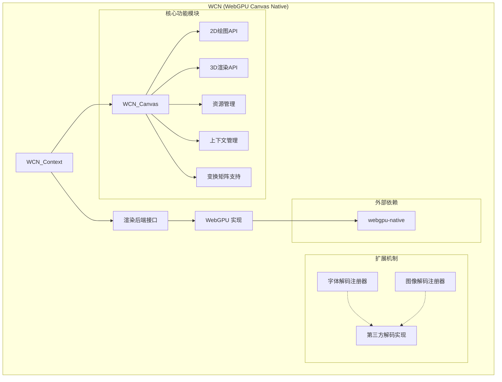

# WCN (WebGPU Canvas Native)

一个与窗口、资源处理无关的基于 webgpu-native 的 W3C 规范的纯 C 语言 Canvas 库，支持 2D 与 3D 渲染。

## 项目特点

- 纯 C 语言实现，符合 C11 标准
- 基于 WebGPU 的渲染后端，支持高性能图形渲染
- 实现 W3C Canvas API 规范
- 跨平台支持（Windows, Linux, macOS）
- 支持 WASM 平台
- 可扩展的字体/图像解码注册机制
- 函数式编程风格，使用安全宏

## 系统架构



## 项目结构

```
.
├── examples/           # 使用示例
├── external/           # 外部依赖
│   └── wgpu/           # webgpu-native库
├── include/            # 公共头文件
├── src/                # 源代码
├── CMakeLists.txt      # CMake构建配置
├── build.zig           # Zig构建脚本
└── README.md           # 项目说明
```

## 后续计划

1. WCW (WebGPU Canvas Web) - 一个 WCN Wasm + TS 的 npm 包
2. 完整的 W3C Canvas API 实现
3. 3D 渲染功能支持
4. 更多的扩展解码器实现

## 许可证

[待定]
