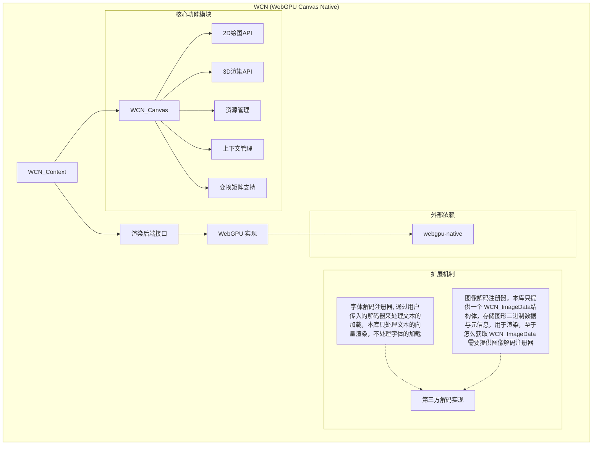

# WCN (WebGPU Canvas Native)

一个与窗口、资源处理无关的基于 webgpu-native 的 W3C 规范的纯 C 语言 工业级的 Canvas 库，支持 完整的2D 渲染。

## 项目特点

- 纯 C 语言实现，符合 C11 标准
- 基于 WebGPU 的渲染后端，支持高性能图形渲染
- 实现 W3C Canvas API 规范
- 跨平台支持（Windows, Linux, macOS）
- 支持 WASM 平台
- 可扩展的字体/图像解码注册机制
- 函数式编程风格，使用安全宏

## 系统架构



## 项目结构

```
.
├── examples/           # 使用示例
├── external/           # 外部依赖
│   └── wgpu/           # webgpu-native库
├── include/            # 公共头文件
├── src/                # 源代码
├── CMakeLists.txt      # CMake构建配置
├── build.zig           # Zig构建脚本
└── README.md           # 项目说明
```

## 已实现功能

### ✅ 核心2D渲染
- **矩形绘制**: `fillRect()`, `strokeRect()`, `clearRect()`
- **路径操作**: `beginPath()`, `moveTo()`, `lineTo()`, `closePath()`, `arc()`
- **路径渲染**: `fill()`, `stroke()`
- **线条样式**: 
  - 线帽 (Line Caps): BUTT, ROUND, SQUARE - 完全实现
  - 线连接 (Line Joins): MITER, ROUND, BEVEL - 基于CPU三角化实现
- **高质量抗锯齿**: 基于GPU着色器的向量渲染

### ✅ 变换系统
- **基础变换**: `translate()`, `rotate()`, `scale()`
- **高级变换**: `transform()`, `setTransform()`, `resetTransform()`
- **状态管理**: `save()`, `restore()`
- **CPU端变换**: 高效的矩阵运算，在顶点生成时应用
- **100% Canvas2D兼容**: 完整实现W3C规范

### ✅ 样式系统
- **颜色设置**: `fillStyle`, `strokeStyle`
- **线条样式**: 
  - 线宽: `lineWidth`
  - 线帽: `lineCap` (BUTT, ROUND, SQUARE)
  - 线连接: `lineJoin` (MITER, ROUND, BEVEL)
  - 斜接限制: `miterLimit`
- **透明度**: `globalAlpha`

## 快速开始

### 本地编译

```bash
mkdir build && cd build
cmake ..
cmake --build .
```

### WebAssembly 编译

```bash
# Linux/macOS
./build-wasm.sh

# Windows
build-wasm.bat
```

详细的 WASM 构建说明请参考 [WASM 构建文档](docs/WASM_BUILD.md)。

### WebAssembly 特性

WCN 的 WebAssembly 版本现在包含以下增强功能：

- **HTML5 Canvas 包装器**: 提供类似 HTML5 Canvas2D API 的 JavaScript 接口
- **WASM 字体检码器**: 通过 JavaScript 互操作实现字体加载和文本渲染
- **完整的 2D 绘图 API**: 支持所有核心 Canvas2D 功能
- **变换系统**: 完整的变换操作支持（translate, rotate, scale等）

### 运行示例

```bash
# 变换系统完整测试
cd build
.\examples\GLFW\transform_complete_test.exe

# 按数字键1-8切换不同测试
# 按ESC退出
```

### 示例代码

```c
#include "WCN/WCN.h"

// 创建上下文
WCN_Context* ctx = wcn_create_context(&gpu_resources);

// 开始帧
wcn_begin_frame(ctx, width, height, surface_format);
wcn_begin_render_pass(ctx, texture_view);

// 绘制矩形
wcn_set_fill_style(ctx, 0xFFFF0000);  // 红色
wcn_fill_rect(ctx, 50, 50, 100, 100);

// 应用变换
wcn_save(ctx);
wcn_translate(ctx, 200, 200);
wcn_rotate(ctx, 3.14159 / 4);  // 45度
wcn_set_fill_style(ctx, 0xFF0000FF);  // 蓝色
wcn_fill_rect(ctx, -50, -50, 100, 100);
wcn_restore(ctx);

// 结束帧
wcn_end_render_pass(ctx);
wcn_submit_commands(ctx);
```

## 文档

- [变换系统文档](docs/TRANSFORM_SYSTEM.md)
- [TODO列表](TODO.md)

## 后续计划

1. **文本渲染优化**: 完成MSDF文本渲染系统
2. **图像操作**: 实现 `drawImage()` 和图像数据操作
3. **渐变和模式**: 线性渐变、径向渐变、模式填充
4. **性能优化**: 进一步优化批次渲染和GPU利用率
5. **WCW (WebGPU Canvas Web)**: WASM + TypeScript 的 npm 包
6. **更多解码器**: 支持更多字体和图像格式

## 许可证

[待定]
